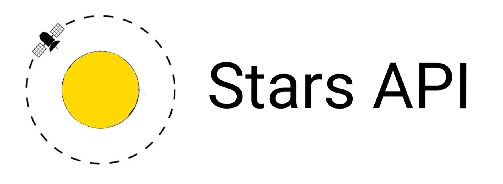

# Stars API ⭐🌟
Stars API , get all stars in universe at one place .

_This is the latest version of Stars-API . [version- 2]_

This Stars API is made by [Junaid](https://www.abujuni.dev) . It also includes images .

_Star Data by [Junaid](https://www.abujuni.dev) ._

**Stars API is Now online at https://starsapi.abujuni.dev (or) https://stars-api.onrender.com .**

## Index

- [Stars Data API](#star-data-api)
- [Star Data Search API](#star-data-search-api)
- [Star Images Search API](#star-images-search-api)
- [Installation](#installation)

## Star Data API

_Star Data by [Junaid](https://www.abujuni.dev) ._

Index page is the API which shows all stars in json format , every star data is in a array format .

```
http://127.0.0.1:5000/
```

_Tip : This API is easy to make a flatlist react app ._

## Star Data Search API


```
http://127.0.0.1:5000/stars?name=Proxima Centauri
```

or

```
http://127.0.0.1:5000/stars?name=sun
```

**Return**

```
{"data":{"Distance":1.5813e-05,"Gravity":274.2691614596,"Mass":1.0,"Radius":1.0,"Star_name":"Sun"},"message":"Success !"}
```

## Star Images Search API


```
http://127.0.0.1:5000/stars-img?name=Proxima Centauri
```

or

```
http://127.0.0.1:5000/stars-img?name=sun
```

**Return**

```
{"img_url":"http://images-assets.nasa.gov/image/PIA18906/PIA18906~thumb.jpg","message":"Success !"}
```

## Installation

- Clone this repo
- Open terminal in that cloned folder and
- Install all requirements using -> `pip install -r requirements.txt`
- Than type -> `flask run`
- Ola! , Star API is Launched at http://127.0.0.1:5000/

**Made By [Junaid](https://www.abujuni.dev) .**
